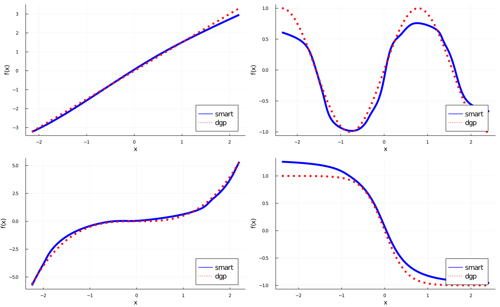

# SMARTboost

R version of SMARTboost.jl via the JuliaConnectoR package (requires Julia to be installed).

SMARTboost (Smooth Additive Regression Trees) is described in the paper [SMARTboost learning for tabular data](https://ssrn.com/abstract=3975543). The Julia package is available at https://github.com/PaoloGiordani/SMARTboost.jl

Currently support only L2 loss, but extensions are planned.

??????????? Say something about input features ???????????????????
Julia version (Input features can be a be `Array{Float64/Float32}` or DataFrame (which is internally converted to a matrix of floats.))


## Installation

1) Ensure Julia is installed. Julia can be downloaded from (https://julialang.org/downloads/)
2) Ensure that the Julia executable is in the system search PATH or that the JULIA_BINDIR environment variable is set to the bin   directory of the Julia installation.
For example: To find the path of the Julia executable, locate the file julia.exe or run 'Sys.BINDIR' from the Julia command line. Then, in R, start your script with
```r-repl
R> Sys.setenv(JULIA_BINDIR = "path_of_julia_executable")
```
3) Install JuliaConnectoR, available from the official R repository and from https://github.com/stefan-m-lenz/JuliaConnectoR, e.g.
```r-repl
R> install.packages("JuliaConnectoR")
```
4) Install the Julia packages Distributed and SMARTboost. Enter the Pkg REPL by pressing ] from the Julia REPL. Then
```julia-repl
Pkg> add Distributed
Pkg> add "https://github.com/PaoloGiordani/SMARTboost.jl"
```

## Use
```r-repl
R> SMARTboost = juliaImport("SMARTboost")
```
You may receive the warning message: "Some names could not be expressed in the native encoding..."
This is due to some Greek characters, which R may not recognize. In future versions, I plan to eliminate the
problem by staying with US-ASCII encoding. For now, this means that, for some R users, over-riding some defaults in SMARTparam
may not be possible.

# Set the desired number of workers for parallelization (optional)
```r-repl
R> juliaEval('
R>           number_workers  = 4  # desired number of workers, e.g. 4
R>           using Distributed
R>           nprocs()<number_workers ? addprocs( number_workers - nprocs()  ) : addprocs(0)
R>           @everywhere using SMARTboost
R>           ')
```

## Selected Parameters (incomplete list, see SMARTparam Documentation for more).

- `loss`              [:L2] currently only :L2 is supported, but extensions are planned
- `depth`             [4] tree depth. If not default, then typically cross-validated in SMARTfit.
- `lambda`            [0.2] learning rate
- `loglikdivide`      [1.0] with panel data, SMARTloglikdivide() can be used to set this parameter
- `overlap`           [0] number of overlaps. Typically overlap = h-1, where y(t) = Y(t+h)-Y(t)
- `nfold`             [5] n in n-fold cv. Set nfold = 1 for a single validation set, the last sharevalidation share of the sample.
- `verbose`           [:Off] verbosity "On" or "Off"
- `T`                 [Float32] Float32 is faster than Float64. If NaN output is produced (e.g. if true R2 is 1.0), switching to Flot64 should fix the problem.
- `randomizecv`       [FALSE] default is purged-cv (see paper); a time series or panel structure is automatically detected (see SMARTdata)

## Example1 with n = 1_000


## Example1 with n = 1_000_000


## Example1

```r-repl 

# install.packages("JuliaConnectoR")    # If needed, install JuliaConnectoR. https://github.com/stefan-m-lenz/JuliaConnectoR

# User's options

path_julia_binaries = "I:\\Software\\Julia-1.4.2\\bin"   # string, location of Julia binaries (see ReadMe -> Installation)

# Some options for SMARTboost
cvdepth   = FALSE    # false to use the default depth (3), true to cv
nfold     = 1        # nfold cv. 1 faster, default 5 is slower, but more accurate.

# options to generate data. y = sum of four additive nonlinear functions + Gaussian noise(0,stde^2)
n      = 1000
p      = 4
stde   = 1.0

n_test= 100000

f_1 = function(x,b)  x*b
f_2 = function(x,b)  sin(x*b)
f_3 = function(x,b)  b*x^3
f_4 = function(x,b)  b/(1.0 + (exp(4.0*x))) - 0.5*b

b1  = 1.5
b2  = 2.0
b3  = 0.5
b4  = 2.0

# Optionally, set number_workers below
# End user's options  #

library(JuliaConnectoR)
Sys.setenv(JULIA_BINDIR = path_julia_binaries)

SMARTboost = juliaImport("SMARTboost")

# Set the desired number of workers for parallelization   
juliaEval('
          number_workers  = 4  # desired number of workers, e.g. 4
          using Distributed
          nprocs()<number_workers ? addprocs( number_workers - nprocs()  ) : addprocs(0)
          @everywhere using SMARTboost
          ')

# generate data
x      = matrix(rnorm(n*p),nrow = n,ncol = p)
x_test = matrix(rnorm(n_test*p),nrow = n,ncol = p)
f      = f_1(x[,1],b1)+f_2(x[,2],b2)+f_3(x[,3],b3)+f_4(x[,4],b4)
f_test = f_1(x_test[,1],b1)+f_2(x_test[,2],b2)+f_3(x_test[,3],b3)+f_4(x[,4],b4)
y      = f + rnorm(n)*stde

# set up SMARTparam and SMARTdata, then fit and predit
param  = SMARTboost$SMARTparam( nfold = nfold,verbose = "Off" )
data   = SMARTboost$SMARTdata(y,x,param)

if (cvdepth==FALSE){
  output = SMARTboost$SMARTfit(data,param)                # default depth
} else {
  output = SMARTboost$SMARTfit(data,param,paramfield="depth",cv_grid=c(1,2,3,4,5),stopwhenlossup=TRUE)  # starts at depth = 1, stops as soon as loss increases
}

# Display some output and plot loss vs iteration

ntrees = output$ntrees
"number of trees "; ntrees
"best_cv_value   "; output$bestvalue

plot(1:ntrees,output$meanloss[1:ntrees], type = 'l',main = "loss vs iteration",col = "blue",)

# forecast
yf     = SMARTboost$SMARTpredict(x_test,output$SMARTtrees)  # predict
RMSE  = sqrt(sum((yf - f_test)^2)/n_test)   
"RMSE "; RMSE

# feature importance, partial dependence plots and marginal effects
tuple  = SMARTboost$SMARTrelevance(output$SMARTtrees,data)

list   = juliaGet(tuple)
fnames = list[1]               # names of features
fi     = list[2]               # feature importance vector
fnames_sorted = list[3]        # names, sorted from most to least important
fi_sorted     = list[4]        # importance, sorted from largest to smallest
sortedindx    = list[5]        # sorted indexes, from largest to smallest importance

# partial dependence plot. Notice that when changing feature i, all other features are fixed at their unconditional mean.
tuple = SMARTboost$SMARTpartialplot(data,output$SMARTtrees,c(1,2,3,4),npoints=1000) # the third input is the J-dimensional vector of features for which to compute partial dependence

list = juliaGet(tuple)
q    = list[1]    # values at which partial dependence is computed, (plot on x-axis) (npoints,J)
pdp  = list[2]    # partial dependence (plot on y-axis), (npoints, J)

# marginal effects
tuple = SMARTboost$SMARTpartialplot(data,output$SMARTtrees,c(1,2,3,4),npoints=1000)


```
